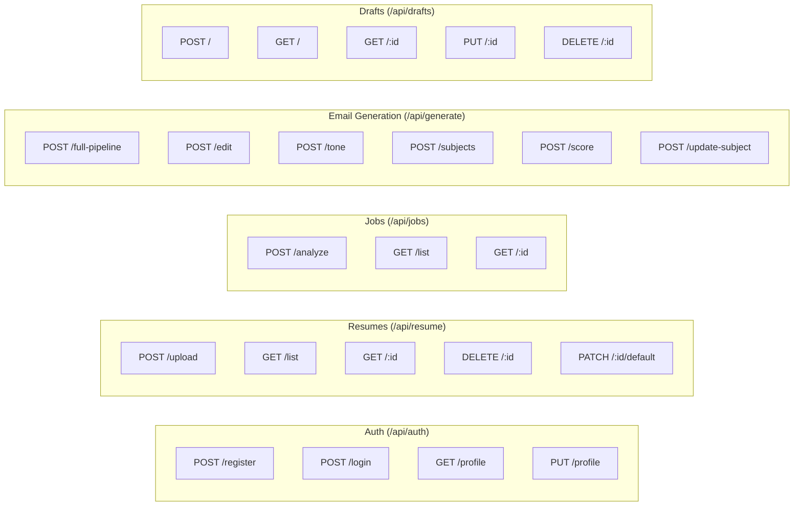

# API Reference Documentation: MailCraft AI

This document provides request and response formats for the REST API endpoints in the MailCraft AI backend.

- **Base URL**: `http://localhost:5000` (development) or proxied under `/api/*` in the Vite configuration.
- **Headers**:
  - `Content-Type: application/json` (except multipart uploads)
  - `Authorization: Bearer <JWT_TOKEN>` (for protected endpoints)

---

## 1. API Endpoints Directory



---

## 2. Authentication Routes (`/api/auth`)

### A. Register User
- **URL**: `/api/auth/register`
- **Method**: `POST`
- **Request Body**:
  ```json
  { "name": "Jane Doe", "email": "jane@example.com", "password": "securepassword123" }
  ```
- **Response (201 Created)**:
  ```json
  { "token": "eyJhbGci...", "user": { "id": "603d27f8a1fd876c12345678", "name": "Jane Doe", "email": "jane@example.com" } }
  ```

### B. Login User
- **URL**: `/api/auth/login`
- **Method**: `POST`
- **Request Body**:
  ```json
  { "email": "jane@example.com", "password": "securepassword123" }
  ```
- **Response (200 OK)**:
  ```json
  { "token": "eyJhbGci...", "user": { "id": "603d27f8a1fd876c12345678", "name": "Jane Doe", "email": "jane@example.com" } }
  ```

---

## 3. Resume Routes (`/api/resume`)

### A. Upload & Parse Resume
- **URL**: `/api/resume/upload`
- **Method**: `POST`
- **Content-Type**: `multipart/form-data`
- **Body**: File appended with key `"resume"` (supports `.pdf`, `.docx`, `.txt`).
- **Response (201 Created)**:
  ```json
  {
    "message": "Resume uploaded and parsed successfully",
    "resume": {
      "id": "603d27f8a1fd876c00000001",
      "fileName": "resume.pdf",
      "fileType": "pdf",
      "fileSize": 120560,
      "parsedProfile": {
        "name": "Jane Doe",
        "email": "jane@example.com",
        "skills": ["React", "CSS", "Node.js"],
        "education": [],
        "projects": [],
        "experience": []
      },
      "isDefault": true,
      "uploadedAt": "2026-06-24T00:00:00.000Z"
    }
  }
  ```

---

## 4. Job Analysis Routes (`/api/jobs`)

### A. Analyze Job URL
- **URL**: `/api/jobs/analyze`
- **Method**: `POST`
- **Request Body**:
  ```json
  { "url": "https://linkedin.com/jobs/view/123456789" }
  ```
- **Response (200 OK)**:
  ```json
  {
    "message": "Job analyzed successfully",
    "job": {
      "_id": "603d27f8a1fd876c87654321",
      "title": "React Developer",
      "company": "Tech Corp",
      "platform": "linkedin",
      "location": "Remote",
      "skills": ["React", "HTML5", "CSS3"],
      "responsibilities": ["Design user interfaces", "Implement dynamic components"],
      "status": "analyzed"
    }
  }
  ```

---

## 5. Email Generation Routes (`/api/generate`)

### A. Run Full Pipeline
- **URL**: `/api/generate/full-pipeline`
- **Method**: `POST`
- **Request Body**:
  ```json
  {
    "jobUrl": "https://linkedin.com/jobs/view/123456789",
    "resumeId": "603d27f8a1fd876c00000001",
    "userSummary": "I recently won a hackathon",
    "instructions": "Make it sound startup-friendly"
  }
  ```
- **Response (200 OK)**:
  ```json
  {
    "message": "Email generated successfully",
    "email": {
      "_id": "603d27f8a1fd876c99999999",
      "subject": "Application for React Developer Role",
      "content": "Hi Team, I noticed your post...",
      "htmlContent": "<p>Hi Team,</p>",
      "tone": "professional",
      "qualityScores": {
        "overallScore": 85,
        "professionalismScore": 90,
        "personalizationScore": 80,
        "grammarScore": 95,
        "readabilityScore": 85,
        "recruiterAppealScore": 80,
        "ctaScore": 80
      }
    },
    "jobAnalysis": { ... },
    "matchAnalysis": {
      "matchScore": 88,
      "matchingSkills": ["React"],
      "missingSkills": ["TypeScript"],
      "strengths": ["Hackathon winner"],
      "weaknesses": ["No TypeScript experience"]
    },
    "qualityScores": { ... },
    "subjectOptions": ["Subject 1", "Subject 2"]
  }
  ```

### B. AI Chat Edit
- **URL**: `/api/generate/edit`
- **Method**: `POST`
- **Request Body**:
  ```json
  {
    "emailId": "603d27f8a1fd876c99999999",
    "instruction": "Mention my hackathon win",
    "chatHistory": [
      { "role": "user", "content": "Mention my hackathon win" }
    ]
  }
  ```
- **Response (200 OK)**:
  ```json
  {
    "message": "Email updated",
    "email": { ... },
    "changeDescription": "Added detail highlighting your hackathon victory."
  }
  ```

### C. Change Tone Preset
- **URL**: `/api/generate/tone`
- **Method**: `POST`
- **Request Body**:
  ```json
  { "emailId": "603d27f8a1fd876c99999999", "tone": "startup" }
  ```
- **Response (200 OK)**:
  ```json
  { "message": "Tone changed to startup", "email": { ... } }
  ```

---

## 6. Saved Drafts Routes (`/api/drafts`)

- **`POST /api/drafts`**: Saves current email as a draft.
- **`GET /api/drafts`**: Lists all saved drafts.
- **`GET /api/drafts/:id`**: Gets a single draft.
- **`PUT /api/drafts/:id`**: Updates an existing draft's contents.
- **`DELETE /api/drafts/:id`**: Deletes a draft.

---

## 7. Dashboard Metrics Route (`/api/dashboard`)

### A. Get Stats
- **URL**: `/api/dashboard/stats`
- **Method**: `GET`
- **Response (200 OK)**:
  ```json
  {
    "stats": {
      "totalEmails": 15,
      "totalJobs": 12,
      "totalResumes": 2,
      "avgMatchScore": 82
    },
    "recentEmails": [ ... ],
    "recentJobs": [ ... ]
  }
  ```
