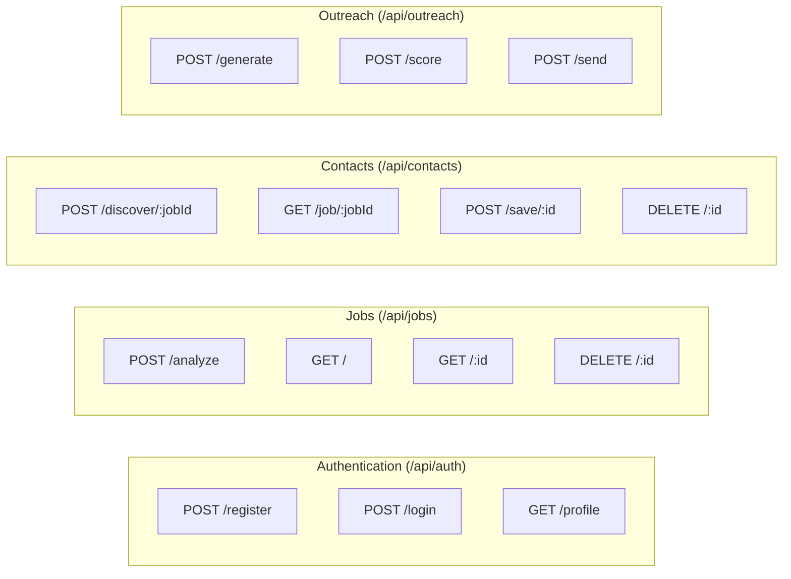

# API REFERENCE DOCUMENTATION: ColdMail AI Agent

## 1. Global API Standards

- **Base URL**: `http://localhost:5000` (development) or relative routes proxied via Vite config (`/api/*`).
- **Headers**:
  - `Content-Type: application/json`
  - `Authorization: Bearer <JWT_TOKEN>` (for protected endpoints)
- **Standard Error Format**:
  ```json
  {
    "message": "Error description string",
    "errors": [] // Optional validation errors array
  }
  ```

---

## 2. API Endpoint Directory



---

## 3. Auth Routes (`/api/auth`)

### A. Register New User
- **URL**: `/api/auth/register`
- **Method**: `POST`
- **Auth Required**: No
- **Request Body**:
  ```json
  {
    "name": "Jane Doe",
    "email": "jane@example.com",
    "password": "securepassword123"
  }
  ```
- **Response (201 Created)**:
  ```json
  {
    "token": "eyJhbGciOiJIUzI1NiIsInR5cCI6IkpXVCJ9...",
    "user": {
      "id": "603d27f8a1fd876c12345678",
      "name": "Jane Doe",
      "email": "jane@example.com"
    }
  }
  ```
- **Validation Errors (400 Bad Request)**:
  ```json
  {
    "message": "Validation failed",
    "errors": [
      { "msg": "Name is required", "path": "name" },
      { "msg": "Please provide a valid email", "path": "email" },
      { "msg": "Password must be at least 6 characters", "path": "password" }
    ]
  }
  ```

### B. Login User
- **URL**: `/api/auth/login`
- **Method**: `POST`
- **Auth Required**: No
- **Request Body**:
  ```json
  {
    "email": "jane@example.com",
    "password": "securepassword123"
  }
  ```
- **Response (200 OK)**:
  ```json
  {
    "token": "eyJhbGciOiJIUzI1NiIsInR5cCI6IkpXVCJ9...",
    "user": {
      "id": "603d27f8a1fd876c12345678",
      "name": "Jane Doe",
      "email": "jane@example.com"
    }
  }
  ```
- **Authentication Error (401 Unauthorized)**:
  ```json
  {
    "message": "Invalid email or password"
  }
  ```

---

## 4. Jobs Routes (`/api/jobs`)

### A. Submit & Analyze Job URL
Scrapes the target job description and extracts details using AI.
- **URL**: `/api/jobs/analyze`
- **Method**: `POST`
- **Auth Required**: Yes
- **Request Body**:
  ```json
  {
    "url": "https://www.linkedin.com/jobs/view/123456789"
  }
  ```
- **Response (201 Created)**:
  ```json
  {
    "message": "Job analyzed and saved successfully",
    "job": {
      "id": "603d27f8a1fd876c87654321",
      "sourceUrl": "https://www.linkedin.com/jobs/view/123456789",
      "platform": "linkedin",
      "title": "Software Engineer",
      "company": "Tech Corp",
      "location": "San Francisco, CA",
      "jobType": "hybrid",
      "skills": ["React", "Node.js", "MongoDB"],
      "responsibilities": ["Design APIs", "Maintain frontend interfaces"],
      "experienceRequired": "3+ Years",
      "keywords": ["React", "Express", "NoSQL"],
      "description": "A role building high-performance web applications...",
      "status": "analyzed"
    }
  }
  ```

---

## 5. Contact Discovery Routes (`/api/contacts`)

### A. Discover Contacts for a Job
Automatically researches company and discovers ranked stakeholder contact info.
- **URL**: `/api/contacts/discover/:jobId`
- **Method**: `POST`
- **Auth Required**: Yes
- **Response (200 OK)**:
  ```json
  {
    "message": "Contacts discovered successfully",
    "company": {
      "name": "Tech Corp",
      "industry": "Software",
      "website": "https://techcorp.com",
      "companySize": "1000-5000 employees",
      "techStack": ["React", "Node.js", "AWS"],
      "insightSummary": "Tech Corp specializes in building Cloud SaaS tools..."
    },
    "contacts": [
      {
        "id": "603d27f8a1fd876c11223344",
        "fullName": "Alice Smith",
        "role": "Lead Recruiter",
        "department": "Talent Acquisition",
        "email": "alice.smith@techcorp.com",
        "emailStatus": "available",
        "confidenceScore": 95,
        "relevanceScore": 92,
        "isSuggested": false,
        "saved": false
      }
    ]
  }
  ```

---

## 6. Outreach Routes (`/api/outreach`)

### A. Generate Outreach Package
- **URL**: `/api/outreach/generate`
- **Method**: `POST`
- **Auth Required**: Yes
- **Request Body**:
  ```json
  {
    "jobId": "603d27f8a1fd876c87654321",
    "contactId": "603d27f8a1fd876c11223344",
    "outreachType": "job_application",
    "additionalInstructions": "Highlight my 3 years of React experience"
  }
  ```
- **Response (200 OK)**:
  ```json
  {
    "message": "Outreach messages generated and saved as draft.",
    "outreach": {
      "subjectLine": "Software Engineer Role - 3 Years React Experience",
      "coldEmail": "Hi Alice, I noticed your opening...",
      "coldEmailHtml": "<p>Hi Alice,</p><p>I noticed...</p>",
      "linkedinMessage": "Hi Alice, I saw your hiring post...",
      "linkedinFollowUp": "Hi Alice, following up on...",
      "referralRequestEmail": "Hi Alice, I would love a referral...",
      "referralRequestEmailHtml": "<p>Hi Alice,</p>...",
      "shortNetworkingMessage": "Hi Alice..."
    },
    "scores": {
      "overallScore": 88,
      "improvements": ["Shorten the introduction paragraph"]
    },
    "emailId": "603d27f8a1fd876c22334455",
    "recipientEmail": "alice.smith@techcorp.com"
  }
  ```

### B. Send Outreach Email via SMTP
- **URL**: `/api/outreach/send`
- **Method**: `POST`
- **Auth Required**: Yes
- **Request Body**:
  ```json
  {
    "emailId": "603d27f8a1fd876c22334455"
  }
  ```
- **Response (200 OK)**:
  ```json
  {
    "message": "Outreach email sent successfully.",
    "messageId": "<abcd123@gmail.com>"
  }
  ```
- **Error Response (500 Server Error)**:
  ```json
  {
    "message": "Failed to send outreach email via SMTP.",
    "error": "Authentication Failed (Invalid Credentials)"
  }
  ```

---

## 7. Profile Routes (`/api/profile`)

### A. Match Resume against Job Analysis
- **URL**: `/api/profile/match-resume`
- **Method**: `POST`
- **Auth Required**: Yes
- **Request Body**:
  ```json
  {
    "jobId": "603d27f8a1fd876c87654321"
  }
  ```
- **Response (200 OK)**:
  ```json
  {
    "message": "Resume matched successfully",
    "match": {
      "matchScore": 85,
      "matchingSkills": ["React", "CSS", "REST APIs"],
      "missingSkills": ["TypeScript", "Docker"],
      "recommendedImprovements": ["Add a Docker project to your portfolio"],
      "suggestedProjects": ["Create a microservices application with Docker Compose"],
      "suggestedKeywords": ["Containerization", "RESTful Architecture"],
      "summary": "The candidate has a solid frontend foundation matching the core requirements, but lacks containerization skills mentioned in the job description."
    }
  }
  ```
