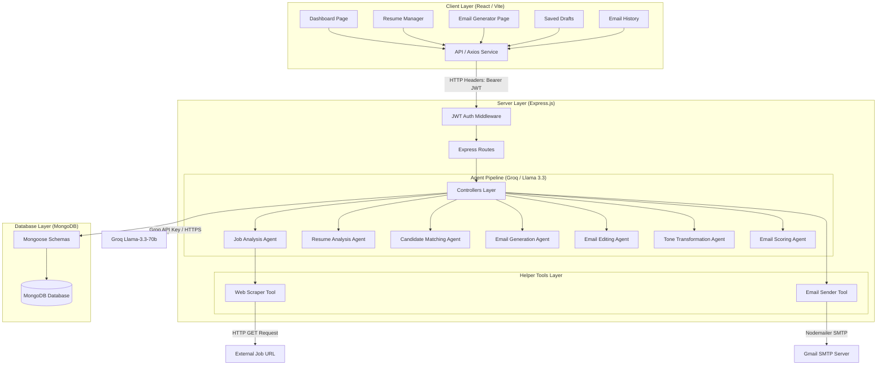
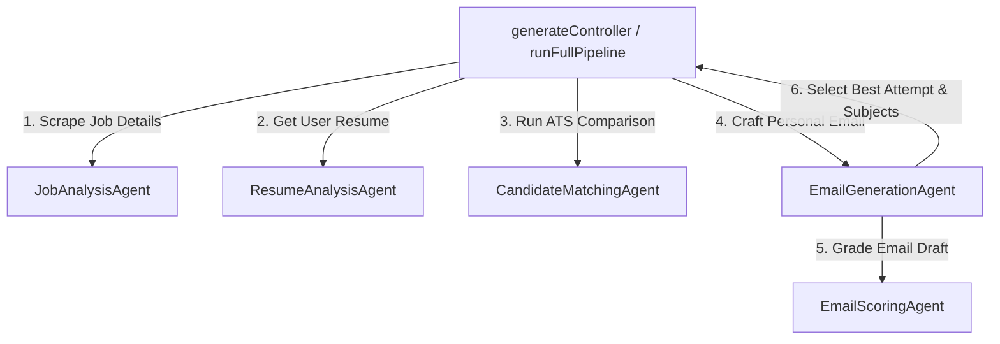

# System Architecture: MailCraft AI

This document details the high-level system architecture, component modules, agent pipelines, and communication flows of the MailCraft AI platform.

---

## 1. High-Level Component Architecture

The application separates concerns between the user client layer (Vite + React) and the API server layer (Express.js + Node.js). Persistence is managed by MongoDB, and AI inference is processed by Groq.

### AI Pipeline Sequence
This diagram represents the flow when executing a full generation pipeline:

---

## 2. Layer Analysis & Responsibilities

### Client Layer (React 18 / Vite / Tailwind)
- **State Management**: Built on modular hooks (`useAuth`) and local component states.
- **Routing**: Client-side routing managed by `react-router-dom` using `<ProtectedRoute>` to validate active JWT sessions.
- **Components**: Styled using Tailwind CSS v3 and Radix UI primitives.
- **Communication**: Requests are made using a centralized Axios client (`frontend/src/services/api.js`) which attaches active authentication Bearer tokens.

### Application Routing & Security (Express / Middleware)
- **Payload Limits**: Handles body payloads up to 15MB to support parsing long resume texts and uploads.
- **Security Headers**: Secured using `helmet` and CORS constraints.
- **Rate Limiting**: Throttles requests via `express-rate-limit` to block spikes.
- **Authorization Middleware**: Decodes and verifies JWT signatures using the custom `auth` alias middleware.

### Controller Coordination Layer
- Controllers (e.g. `generateController`, `resumeController`, `draftController`) orchestrate request cycles. They validate parameter fields, execute database transactions, trigger AI agent pipelines, and format responses.

### Agent Pipeline & Abstraction Layer
- Specialized agents execute prompt structures.
- Agents act independently. They wrap LLM calls using the standard `OpenAI` client SDK pointed to Groq's endpoint (`https://api.groq.com/openai/v1`) using the `llama-3.3-70b-versatile` model.

### Helper Tools Layer
- Fine-grained utility tools:
  - **`WebScraperTool`**: Downloads external HTML pages and extracts main body text using Cheerio.
  - **`EmailSenderTool`**: Sends generated emails via SMTP transporter (Nodemailer).

### Data Persistence Layer (MongoDB / Mongoose)
- Strongly typed database collections (`users`, `resumes`, `jobs`, `drafts`, `emails`).
- Custom indexes configured on lookup keys (e.g., `userId`, `isDefault`, `status`) to support immediate retrieval of paginated data.
