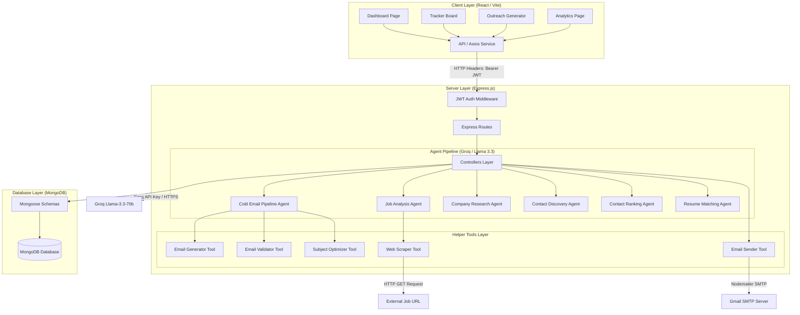
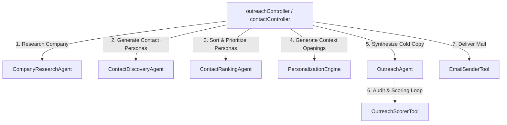

# SYSTEM ARCHITECTURE: ColdMail AI Agent

## 1. High-Level Component Architecture

The system utilizes a decoupling of client and server layers. The frontend communicates with the backend via REST APIs secured by JWT token headers. The backend leverages a pipeline of specialized agents and helper tools to query MongoDB and perform LLM inferences through the Groq API.

### Detailed Agent & Tool Collaboration Sub-Architecture
This diagram details the sequence of calls initiated by the controllers to discover contacts and craft outreach packages.

---

## 2. Layer Analysis & Responsibilities

### Client Layer (React 18 / Vite / Tailwind)
- **State Management**: Built on top of custom React hooks (e.g. `useAuth`, `useEmails`) and React context.
- **Routing**: Client-side routing managed via `react-router-dom` with a `ProtectedRoute` component to validate active sessions.
- **Component Design**: Modular, atomic UI components built via Tailwind CSS and Radix UI primitives (under ShadCN UI folders).
- **Communication**: Outbound HTTP requests handled via a structured Axios client (`frontend/src/services/api.js`) which injects active authentication headers.

### Application Routing & Security (Express / Middleware)
- **JSON Body Parsing**: Handles body payloads up to 10MB to support long resume texts.
- **Security Headers**: Standard Express configuration fortified with `helmet` and standard `cors` origins.
- **Rate Limiting**: Integrated `express-rate-limit` to restrict requests to 100 per 15 minutes (with developer relaxation to 10,000 requests to support offline testing loops).
- **Authorization Middleware**: Decodes and validates JSON Web Tokens (JWT) using a secure token payload model (`req.user = decoded`).

### Controller Coordination Layer
- Controllers (e.g. `jobController`, `outreachController`) act as pipeline orchestrators. They handle:
  1. Validating request parameters.
  2. Resolving existing records in MongoDB (e.g. checking if a company was already researched).
  3. Spawning the corresponding AI Agent pipelines.
  4. Saving output states and sending responses to the client.

### Agent Pipeline & Abstraction Layer
- Specialized agents execute prompt strategies.
- Agents do not interact directly with controllers or routes; they represent single-purpose domain logic (e.g. ranking candidate contacts, parsing job requirements).
- LLM interactions are abstracted using the standard `OpenAI` client SDK pointed to Groq's high-speed endpoint (`https://api.groq.com/openai/v1`) using the `llama-3.3-70b-versatile` model.

### Helper Tools Layer
- Fine-grained utility tools invoked by agents to accomplish specific, deterministic, or recursive tasks:
  - **`WebScraperTool`**: Extracts raw HTML or text from target URLs using Axios and parses content using Cheerio.
  - **`EmailSenderTool`**: Dispatches HTML emails utilizing Nodemailer with SMTP credentials.
  - **`EmailValidatorTool`**: Executes recursive loops, grading generated copy across grammar, readability, spam, and professional tone metrics.
  - **`SubjectOptimizerTool`**: Produces 5 high-converting alternatives to the base subject line.

### Data Persistence Layer (MongoDB / Mongoose)
- Strongly typed, flexible documents defined using Mongoose Schemas.
- High-efficiency indexes configured on `userId` columns, tracking statuses, and sorting keys (`createdAt`) to support immediate retrieval of paginated data.

---

## 3. Communication Protocols

1. **Client-to-Server**: REST APIs over HTTP/HTTPS with JSON payloads.
2. **Server-to-Database**: MongoDB Wire Protocol via Mongoose Driver.
3. **Server-to-AI Provider**: HTTPS POST requests via Groq REST API.
4. **Server-to-SMTP Server**: Secure SMTP over TLS/SSL (port 587 or 465) via Nodemailer.
