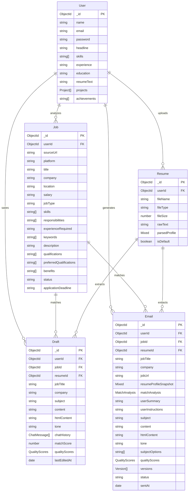

# Database Schema Documentation: MailCraft AI

This document outlines the simplified entity relationship model, collection schemas, and indexes used by the MailCraft AI platform.

---

## 1. Entity Relationship (ER) Diagram

The system operates around a central `User` entity linked to their `Resumes`, `Jobs`, `Drafts`, and generated `Emails`.



---

## 2. Collection Schema Tables

### A. Users
Holds user credentials, optional settings like profile details, and parsed resume summaries.

| Field | Type | Required | Description |
| :--- | :--- | :--- | :--- |
| `name` | String | Yes | User's full name |
| `email` | String | Yes (Unique) | Login email address, normalized to lowercase |
| `password` | String | Yes | bcrypt hashed password (omitted in queries by default) |
| `headline` | String | No | Custom profile headline |
| `skills` | Array [String] | No | Set of skills associated with the user profile |
| `experience` | String | No | Free-form summary of experience |
| `education` | String | No | Free-form summary of education |
| `resumeText` | String | No | Raw text snapshot from the latest resume |
| `projects` | Array [Project] | No | Projects array: `{ name, description, techStack, url }` |
| `achievements` | Array [String] | No | Accomplishments and awards |

---

### B. Resumes
Stores uploaded files (PDF, DOCX, TXT) and their structured, parsed profiles.

| Field | Type | Required | Description |
| :--- | :--- | :--- | :--- |
| `userId` | ObjectId | Yes | Reference to User |
| `fileName` | String | Yes | Name of the file uploaded (e.g., `resume.pdf`) |
| `fileType` | String | Yes | File extension (`pdf`, `docx`, or `txt`) |
| `fileSize` | Number | Yes | File size in bytes |
| `rawText` | String | Yes | Raw string extracted from document parsing |
| `parsedProfile` | Mixed (Object) | Yes | JSON representation structured by `ResumeAnalysisAgent` |
| `isDefault` | Boolean | Yes | Flag for default resume (defaults to `false`) |

---

### C. Jobs
Tracks analyzed job postings scraped from URL postings.

| Field | Type | Required | Description |
| :--- | :--- | :--- | :--- |
| `userId` | ObjectId | Yes | Reference to User |
| `sourceUrl` | String | Yes | URL of the job posting |
| `platform` | String | Yes | Platform name (`linkedin`, `naukri`, `internshala`, etc.) |
| `title` | String | Yes | Job title |
| `company` | String | Yes | Company name |
| `location` | String | No | Job location |
| `salary` | String | No | Salary details |
| `jobType` | String | Yes | remote, hybrid, onsite, unknown |
| `skills` | Array [String] | No | Extracted mandatory/preferred skills |
| `responsibilities` | Array [String] | No | List of key responsibilities |
| `experienceRequired` | String | No | Experience descriptor |
| `keywords` | Array [String] | No | ATS-friendly keywords |
| `description` | String | No | Role description |
| `qualifications` | Array [String] | No | Minimum qualifications |
| `preferredQualifications`| Array [String]| No | Preferred qualifications |
| `benefits` | Array [String] | No | Listed benefits and perks |
| `status` | String | Yes | analyzed, email_generated, archived |
| `applicationDeadline` | String | No | Expiry date of the posting |

---

### D. Drafts
Stores active work-in-progress emails that users are editing or tweaking.

| Field | Type | Required | Description |
| :--- | :--- | :--- | :--- |
| `userId` | ObjectId | Yes | Reference to User |
| `jobId` | ObjectId | No | Reference to Job |
| `resumeId` | ObjectId | No | Reference to Resume |
| `jobTitle` | String | No | Job title context |
| `company` | String | No | Company context |
| `subject` | String | Yes | Current subject line |
| `content` | String | Yes | Plain text body |
| `htmlContent` | String | No | HTML formatted body |
| `tone` | String | Yes | Selected tone preset |
| `chatHistory` | Array [Message] | No | Chat editing history: `{ role, content, timestamp }` |
| `matchScore` | Number | No | Candidate matching score (0-100) |
| `qualityScores` | Object | No | 6-dimension quality breakdown |
| `lastEditedAt` | Date | Yes | Timestamp of last edit |

---

### E. Emails
Saves final copies of all generated emails, version histories, and quality feedback.

| Field | Type | Required | Description |
| :--- | :--- | :--- | :--- |
| `userId` | ObjectId | Yes | Reference to User |
| `jobId` | ObjectId | No | Reference to Job |
| `resumeId` | ObjectId | No | Reference to Resume |
| `jobTitle` | String | No | Title of the position |
| `company` | String | No | Target company |
| `jobUrl` | String | No | Reference posting link |
| `resumeProfileSnapshot` | Mixed (Object) | Yes | Cached snapshot of parsed profile |
| `matchAnalysis` | Object | Yes | Score, matching/missing skills, and strengths/weaknesses |
| `userSummary` | String | No | Summary input used for generation |
| `userInstructions` | String | No | Custom instructions used for generation |
| `subject` | String | Yes | Generated subject line |
| `content` | String | Yes | Plain text email copy |
| `htmlContent` | String | No | HTML email copy |
| `tone` | String | Yes | Active tone preset |
| `subjectOptions` | Array [String] | No | 5 alternative subject lines |
| `qualityScores` | Object | Yes | Detailed quality scoring metrics |
| `versions` | Array [Version] | No | Edit audit log: `{ subject, content, tone, editInstruction }` |
| `status` | String | Yes | draft, final, sent, failed |
| `sentAt` | Date | No | Send timestamp |

---

## 3. Database Indexes

Key indexes configured in Mongoose to boost search and analytics query times:

```javascript
// Resume Collection Indexes
resumeSchema.index({ userId: 1, isDefault: 1 });

// Job Collection Indexes
jobSchema.index({ userId: 1, status: 1 });

// Draft Collection Indexes
draftSchema.index({ userId: 1, lastEditedAt: -1 });

// Email Collection Indexes
emailSchema.index({ userId: 1, createdAt: -1 });
emailSchema.index({ userId: 1, status: 1 });
emailSchema.index({ userId: 1, jobId: 1 });
```
