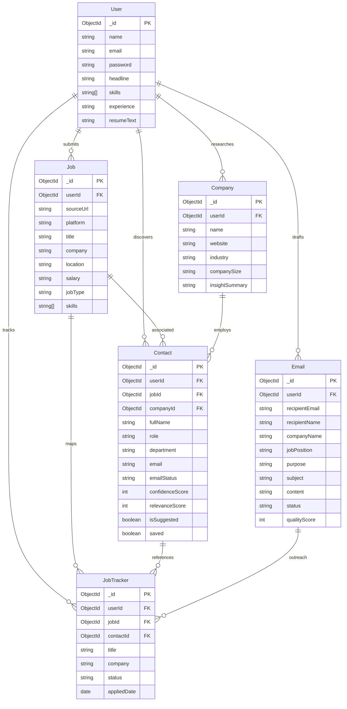

# DATABASE SCHEMA DOCUMENTATION: ColdMail AI Agent

## 1. Entity Relationship (ER) Diagram

The system maps one-to-many relationships anchored around the primary `User` record.



---

## 2. Collection Schema Tables

### A. Users
Persists candidate credential information, headlines, resume text extracts, and background histories.

| Field | Type | Required | Description |
| :--- | :--- | :--- | :--- |
| `name` | String | Yes | Candidate full name |
| `email` | String | Yes (Unique) | Account email, lowercased and format validated |
| `password` | String | Yes | Hashed password (hidden from query results by default) |
| `headline` | String | No | Professional title/headline (max 200 chars) |
| `skills` | Array [String] | No | Candidate skill list |
| `experience` | String | No | Work experience history block |
| `education` | String | No | Education history details |
| `resumeText` | String | No | Parsed text from uploaded resume |
| `projects` | Array [Project] | No | Projects array (name, description, stack, url) |
| `achievements`| Array [String] | No | Notable professional achievements |

---

### B. Jobs
Stores parsed details of job postings analyzed by the system.

| Field | Type | Required | Description |
| :--- | :--- | :--- | :--- |
| `userId` | ObjectId | Yes | Reference to User |
| `sourceUrl` | String | Yes | Source URL |
| `platform` | String | Yes | linkedin, naukri, internshala, careers, other |
| `title` | String | Yes | Job title |
| `company` | String | Yes | Hiring company name |
| `location` | String | No | City, State, or "Remote" |
| `salary` | String | No | Salary range if mentioned |
| `jobType` | String | Yes | remote, hybrid, onsite, unknown |
| `skills` | Array [String] | No | List of required technical/soft skills |
| `responsibilities`| Array [String] | No | Key job responsibilities |
| `experienceRequired`| String | No | Required experience description |
| `keywords` | Array [String] | No | ATS-friendly keywords |
| `description` | String | No | Concise summary of the role |
| `qualifications` | Array [String] | No | Required qualifications |
| `benefits` | Array [String] | No | Listed benefits |
| `status` | String | Yes | analyzed, contacts_found, outreach_sent, archived |

---

### C. Companies
Persists company research and insights gathered during contact discovery.

| Field | Type | Required | Description |
| :--- | :--- | :--- | :--- |
| `userId` | ObjectId | Yes | Reference to User |
| `name` | String | Yes | Company name |
| `website` | String | No | Homepage URL |
| `industry` | String | No | Primary business industry |
| `products` | Array [String] | No | Notable products |
| `services` | Array [String] | No | Notable services |
| `companySize` | String | No | Employee count range |
| `recentNews` | Array [String] | No | Bulleted news details |
| `techStack` | Array [String] | No | Known technical stack |
| `hiringActivity` | String | No | Hiring activity analysis |
| `culture` | String | No | Culture details |
| `mission` | String | No | Mission statement |
| `insightSummary` | String | No | 3-4 sentence outreach summary |

---

### D. Contacts
Details of public hiring contacts or stakeholders discovered for jobs.

| Field | Type | Required | Description |
| :--- | :--- | :--- | :--- |
| `userId` | ObjectId | Yes | Reference to User |
| `jobId` | ObjectId | Yes | Reference to Job |
| `companyId` | ObjectId | No | Reference to Company |
| `fullName` | String | Yes | Contact name |
| `role` | String | Yes | Professional title |
| `department` | String | No | Corporate department |
| `profileUrl` | String | No | LinkedIn or personal URL |
| `sourceUrl` | String | No | Page URL where contact was located |
| `email` | String | No | Contact email address |
| `emailStatus` | String | Yes | available, not_publicly_available |
| `confidenceScore`| Number | Yes | Confidence score (0-100) |
| `relevanceScore` | Number | Yes | Relevance score (0-100) |
| `isSuggested` | Boolean | Yes | True if persona placeholder, false if real person |
| `saved` | Boolean | Yes | Flag if user bookmarked contact |

---

### E. Emails
Tracks plain text and HTML cold outreach drafts and sent emails.

| Field | Type | Required | Description |
| :--- | :--- | :--- | :--- |
| `userId` | ObjectId | Yes | Reference to User |
| `recipientEmail`| String | Yes | Recipient email address |
| `recipientName` | String | No | Recipient name |
| `companyName` | String | No | Company name |
| `jobPosition` | String | No | Job position title |
| `purpose` | String | Yes | job_application, referral_request, etc. |
| `userBackground`| String | No | Profile summary used in generation |
| `additionalNotes`| String | No | Custom instructions from user |
| `tone` | String | Yes | professional, friendly, startup, formal |
| `subject` | String | Yes | Subject line |
| `content` | String | Yes | Plain text body |
| `htmlContent` | String | No | HTML body |
| `status` | String | Yes | draft, sent, failed |
| `qualityScore` | Number | No | Overall validation score (0-100) |
| `suggestions` | Array [String] | No | Formatting improvements suggested by AI |
| `sentAt` | Date | No | Timestamp when email was sent |

---

### F. JobTrackers
Manages job application lifecycle pipeline states (Kanban Board).

| Field | Type | Required | Description |
| :--- | :--- | :--- | :--- |
| `userId` | ObjectId | Yes | Reference to User |
| `jobId` | ObjectId | Yes | Reference to Job |
| `contactId` | ObjectId | No | Reference to Contact |
| `title` | String | Yes | Job title |
| `company` | String | Yes | Company name |
| `sourceUrl` | String | Yes | Source URL |
| `status` | String | Yes | saved, outreach_sent, applied, interview_scheduled, rejected, offer_received |
| `appliedDate` | Date | No | Date applied |
| `notes` | String | No | Personal notes |
| `outreachEmailIds`| Array [ObjectId] | No | Associated emails |
| `statusHistory` | Array [History] | No | Audit trail (status, changedAt, note) |

---

## 3. Database Indexes

To maintain high API performance as collections grow, key indexes are configured in Mongoose:

```javascript
// Jobs Collection Indexes
jobSchema.index({ userId: 1, createdAt: -1 });
jobSchema.index({ userId: 1, company: 1 });
jobSchema.index({ userId: 1, status: 1 });

// Contacts Collection Indexes
contactSchema.index({ userId: 1, jobId: 1 });
contactSchema.index({ userId: 1, saved: 1 });

// Emails Collection Indexes
emailSchema.index({ userId: 1, status: 1 });
emailSchema.index({ userId: 1, createdAt: -1 });

// JobTrackers Collection Indexes
jobTrackerSchema.index({ userId: 1, status: 1 });
jobTrackerSchema.index({ userId: 1, createdAt: -1 });
```
