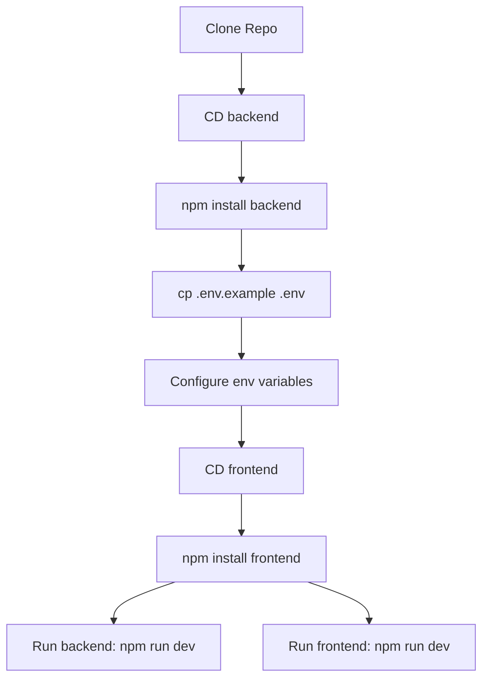
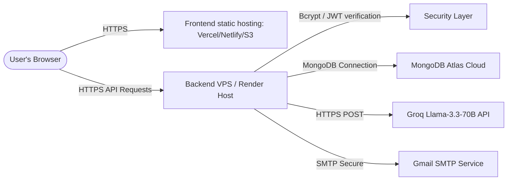

# Deployment Guide & Developer Onboarding: MailCraft AI

This guide covers setting up the project locally for development, configuring third-party integrations, and deploying it to production.

---

## 1. Developer Onboarding: Local Setup

### Local Setup Flow


### Prerequisites
- **Node.js**: Version 20.x or higher (supports native ES Modules and file watching).
- **MongoDB**: Local Community Server running on `localhost:27017` or a MongoDB Atlas connection string.
- **Groq API Key**: Required for Llama-3.3-70b-versatile model inference.
- **Gmail Account (Optional)**: Required for Nodemailer email delivery (uses App Passwords).

### Step-by-Step Installation

1. **Clone the Repository**
   ```bash
   git clone <repository-url>
   cd aiagent
   ```

2. **Backend Setup**
   ```bash
   cd backend
   # Install dependencies
   npm install
   # Create environment config
   cp .env.example .env
   ```
   Open `backend/.env` and update the environment variable values.

3. **Frontend Setup**
   ```bash
   cd ../frontend
   # Install dependencies
   npm install
   ```

4. **Running Locally in Development**
   - **Backend**:
     ```bash
     cd backend
     npm run dev
     ```
     This starts the backend at `http://localhost:5000` with native live reload (`node --watch`).
   - **Frontend**:
     ```bash
     cd frontend
     npm run dev
     ```
     This starts the Vite development server at `http://localhost:5173`.

5. **Open the App**
   Visit `http://localhost:5173` in your browser.

---

## 2. Environment Variables (.env)

| Variable Key | Required | Default Value | Description |
| :--- | :--- | :--- | :--- |
| `PORT` | No | `5000` | Port the Express backend listens on |
| `NODE_ENV` | No | `development` | `development` or `production` |
| `MONGODB_URI` | Yes | `mongodb://localhost:27017/coldmail-agent` | MongoDB connection URI |
| `JWT_SECRET` | Yes | - | Secure signing key for user session tokens |
| `JWT_EXPIRES_IN` | No | `7d` | Expiration timeline for user session tokens |
| `GROQ_API_KEY` | Yes | - | API key for LLM queries |
| `SMTP_HOST` | No | `smtp.gmail.com` | SMTP Server Host |
| `SMTP_PORT` | No | `587` | SMTP TLS Connection Port |
| `SMTP_USER` | Yes | - | Sending email address |
| `SMTP_PASS` | Yes | - | Gmail App Password (not your account login password) |
| `FROM_EMAIL` | Yes | - | Sender email displayed to recipients |
| `FROM_NAME` | No | `MailCraft AI` | Sender name displayed to recipients |

---

## 3. Third-Party Integrations Setup

### A. MongoDB Atlas (Cloud Database)
1. Register for a free account at [mongodb.com](https://www.mongodb.com).
2. Create a Shared Cluster and configure network access to allow IP addresses (e.g. `0.0.0.0/0` or your server's IP).
3. Create a Database User with read and write permissions.
4. Copy the connection string and paste it as `MONGODB_URI` in `backend/.env`.

### B. Gmail SMTP App Password Configuration
Gmail blocks basic authentication for secure connections. You must generate an App Password:
1. Log in to your Google Account.
2. Enable **2-Step Verification** in the Security settings.
3. Navigate to [myaccount.google.com/apppasswords](https://myaccount.google.com/apppasswords).
4. Select **Mail** as the app and **Other (Custom Name)** as the device (e.g., "MailCraft Agent").
5. Copy the 16-character code and paste it as `SMTP_PASS` in `backend/.env` (ensure there are no spaces in the value).

---

## 4. Production Deployment

### Production Deployment Topology


### Backend Deployment (e.g., Render, Heroku, VPS)
1. **Set Production Node Environment**:
   Ensure `NODE_ENV=production` is set in the host server dashboard.
2. **Start Command**:
   Deployments should execute `npm start` (which runs `node src/index.js` directly without watching).
3. **Database Security**:
   Ensure MongoDB network access is restricted to the backend server's outbound IP addresses.

### Frontend Deployment (e.g., Vercel, Netlify, S3/Cloudfront)
1. **Build Static Assets**:
   ```bash
   cd frontend
   npm run build
   ```
   This generates the transpiled assets under the `frontend/dist/` directory.
2. **Configure API Proxy**:
   Deploy static assets to your host provider and configure rewrites/redirects to point `/api/*` requests to the production backend URL (e.g., `https://api.yourdomain.com/:splat`).

---

## 5. Security & Verification Checklist

- [ ] **Disable Debug Limiters**: Set rate limit max bounds in production environments (currently relaxed to 10,000 requests in development).
- [ ] **Rotate JWT Secret**: Use a 32+ character random string for `JWT_SECRET`.
- [ ] **Enable TLS/SSL**: Serve both backend API endpoints and frontend static assets over secure `HTTPS`.
- [ ] **Verify PDF/DOCX Upload Limits**: Check that proxy settings allow file uploads up to 15MB.
