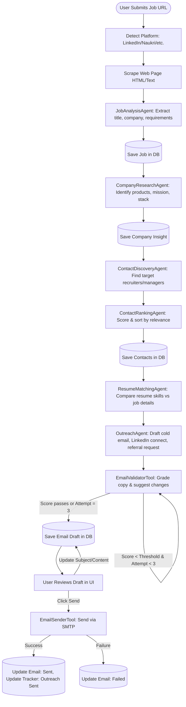
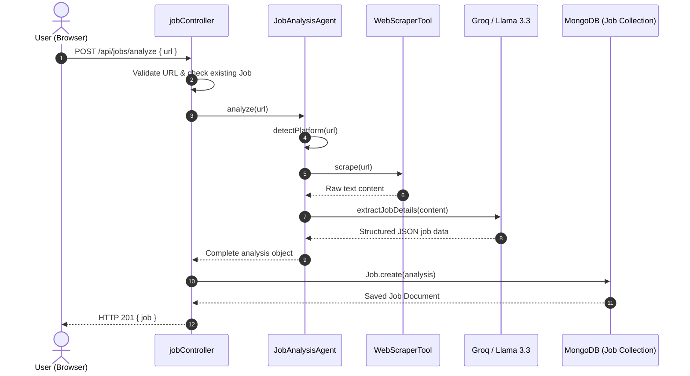
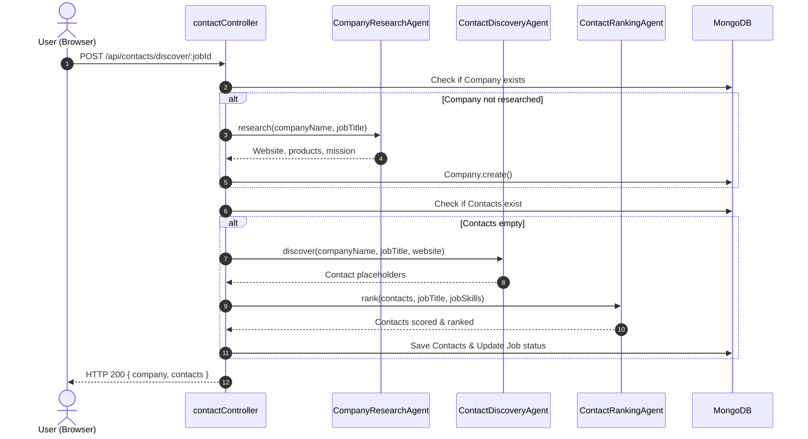
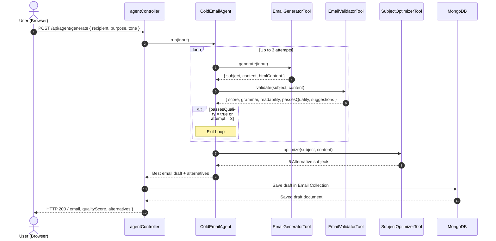
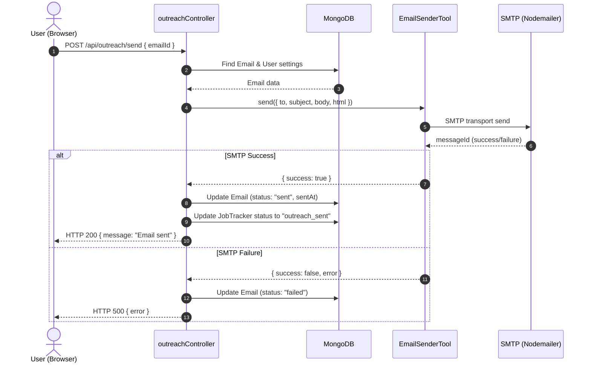
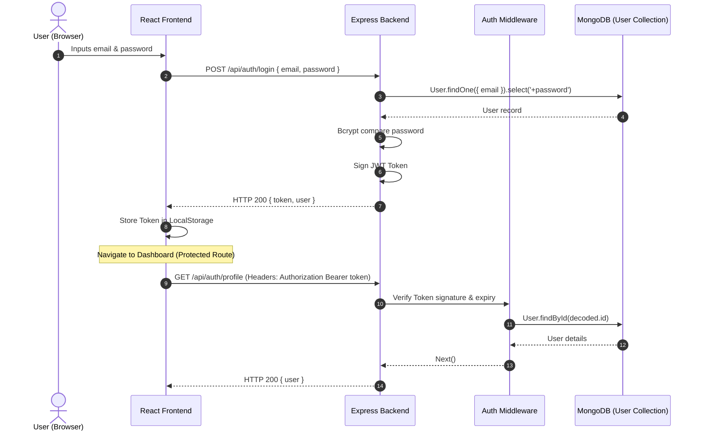
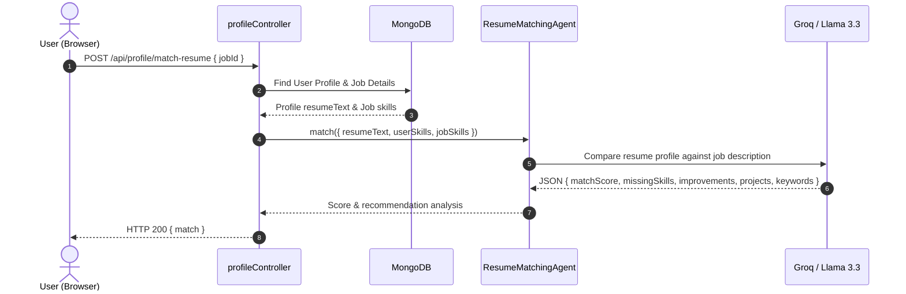

# WORKFLOWS & SEQUENCE DIAGRAMS: ColdMail AI Agent

## 1. High-Level Core Workflow

Below is the visual lifecycle of a job application processed through the system:

---

## 2. Step-by-Step Sequence Diagrams

### A. Job Analysis Flow
This flow details how a user's job URL submission is scraped, parsed, structured, and saved in MongoDB.

### B. Contact Discovery & Ranking Flow
This flow is triggered after a job is analyzed. It researches the company, generates relevant contact templates, and ranks them by match score.

### C. Email Generation & Validation Flow
Coordinates the email generation process. It uses a recursive loop to ensure quality copy before saving the draft.

### D. Email Sending Flow
Dispatches the email via SMTP and transitions the application tracker status.

### E. Authentication Flow
Details how standard JWT security is validated across API calls and client routing.

### F. Resume Matching Flow
Parses the user's resume text, extracts skills, matches it against requirements, and scores it.

