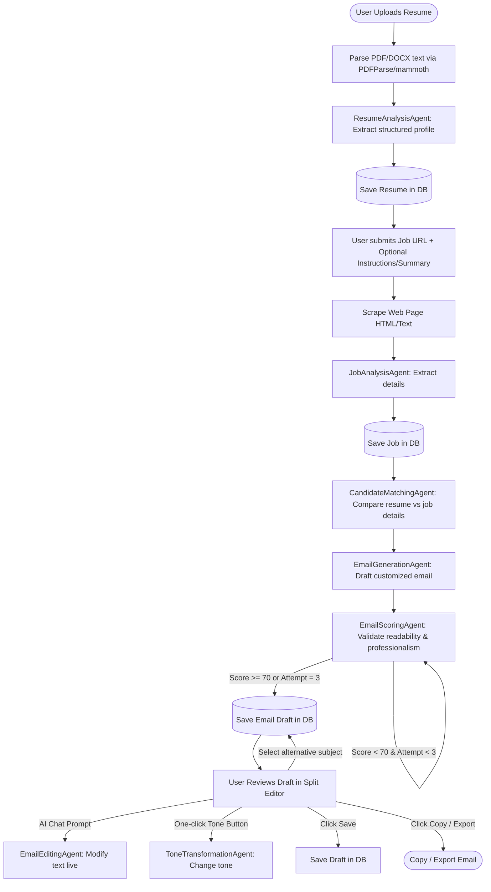
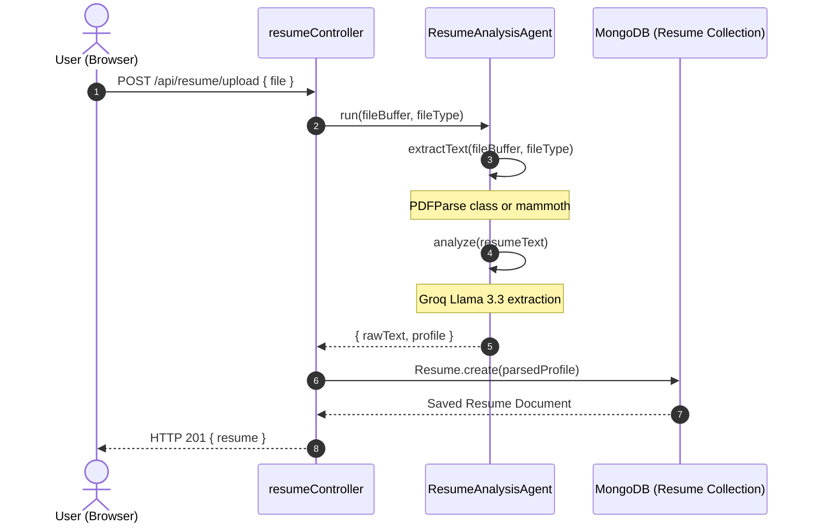
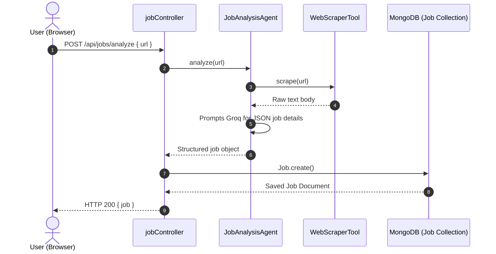
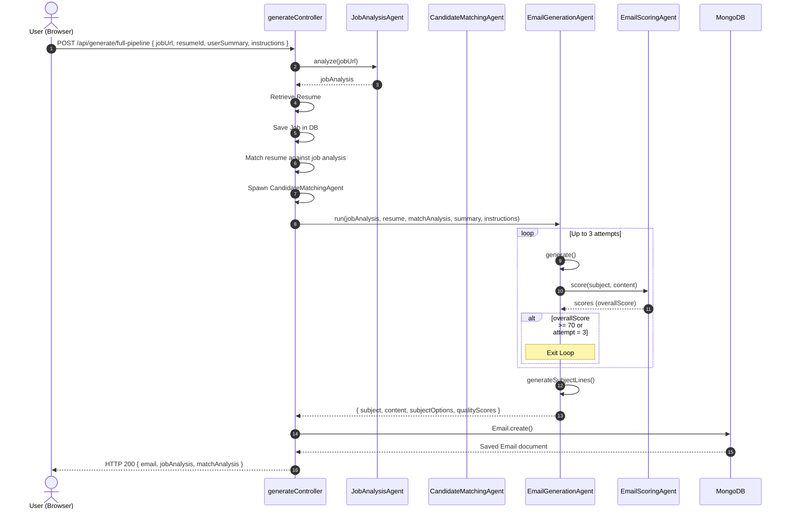
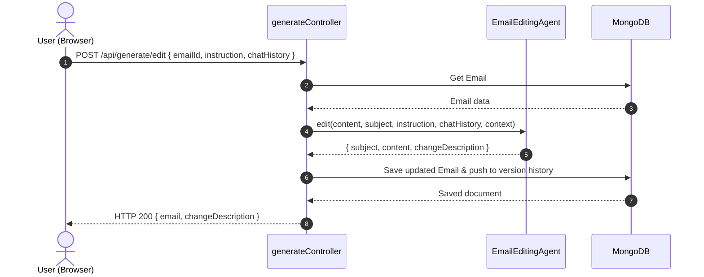
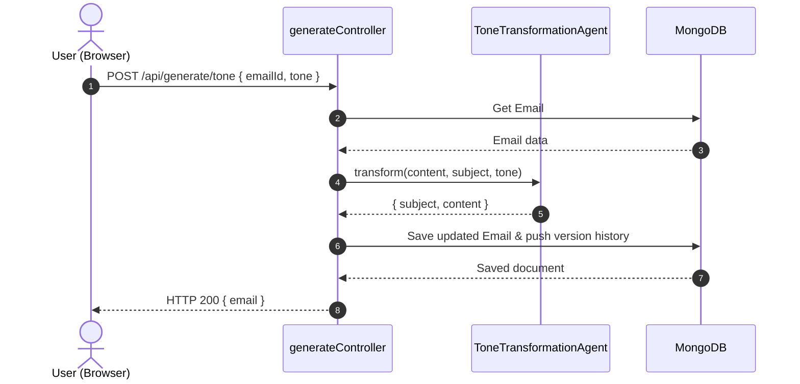

# Workflows & Sequence Diagrams: MailCraft AI

This document provides visual workflows and API call sequences for the core operations of MailCraft AI.

---

## 1. High-Level Core Workflow

Below is the visual lifecycle of a job application processed through the system:

---

## 2. Step-by-Step Sequence Diagrams

### A. Resume Upload & Parsing Flow
This flow details how a user's resume file (PDF, DOCX, TXT) is processed, analyzed, and stored.

### B. Job Analysis Flow
This flow details how a job URL is analyzed and scraped.

### C. Full Email Generation & Quality Flow
This diagram details the sequence when running the full pipeline end-to-end.

### D. AI Chat Editor Flow
Handles updating drafts live in response to conversational prompts.

### E. Tone Transformation Flow
Allows style presetting without affecting resume facts.

